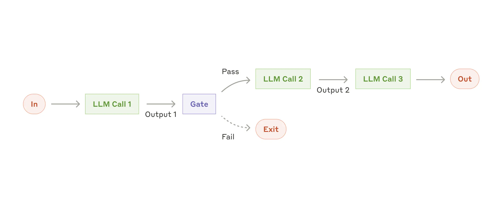
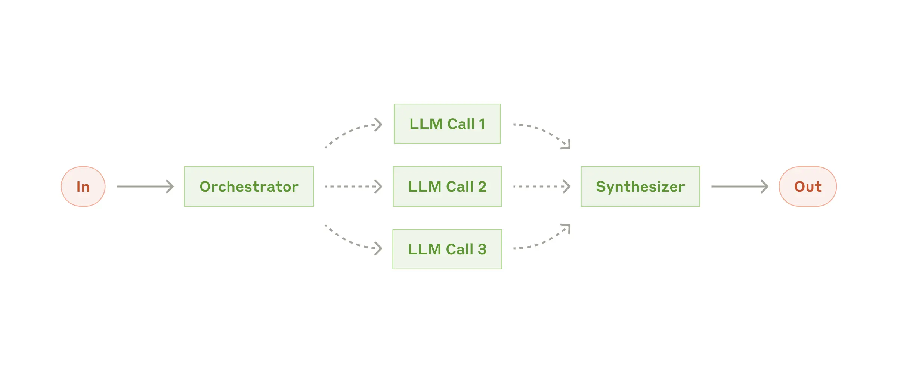

# Building Effective Agent Systems

[Building Effective AI Agents \\ Anthropic](https://www.anthropic.com/engineering/building-effective-agents)
- Workflow vs Agent
	- Workflow: systems where where LLMs and tools are orchestrated to follow a pre-defined path
	- Agent: where LLMs dynamically creates their own processes and tool usage, maintaining control over how they solve tasks.
- When to use a Workflow/Agent
	- Workflow: when the steps of accomplish a task is clear. Workflows offer better predictability and consistency for well-defined tasks.
	- Agent: when the steps need to be dynamically decided by the agent. Agents are better option for tasks that require flexibility and model-driven decision-making at scale.
- Building Block
	- Augmented LLM: an LLM augmented with access to external tools/knowledge base/memory
- Workflows
	- **Prompt Chaining**: where the task solving process is divided into a sequence steps. The output put of the previous steps will be the input of the following steps. This workflow is ideal for situations where the task can be easily and cleanly decomposed into fixed subtasks.
	  
	  
	- **Routing**: where the LLM classifies an input and directs it to a specialized followup task. This workflow allows for separation of concerns, and building more specialized prompts.
	  
	- **Parallelization**: LLMs can sometimes work simultaneously on a task and have their outputs aggregated programmatically. This is good for complex tasks or tasks require higher confidence result. 
		- Task Decomposition (for optimising speed of complex tasks)
		- Resampling (for higher confidence result)
	  
	- **Orchestrator - Workers**: An orchestrator LLM distributes tasks for worker LLMs to do, and then aggregates the result. This is useful for complex tasks that can be easily divided into subtasks.
	  
	- **Evaluator - Optimizer**: An evaluator LLM provides a solution and then receives feedback from an Optimizer LLM. Repeating this loop until meeting a certain criteria such as a maximum number of loops. This workflow is particularly effective when there is clear evaluation criteria, and when iterative refinement provides measurable value.
	  
- Agents
	- LLMs using tools based on environmental feedback in a loop.
- Core Principles
	- Maintain **simplicity** in your agent's design.
	- Prioritize **transparency** by explicitly showing the agent’s planning steps.
	- Carefully craft your agent-computer interface (ACI) through thorough tool **documentation and testing**.

[How we built our multi-agent research system \\ Anthropic](https://www.anthropic.com/engineering/multi-agent-research-system)
- Benefit of multi-agent system
	- Works better for open-ended tasks like research, where no pre-defined pipeline is provided. 
	- Maintain multiple threads of investigation independently.
	- Easily scale performance through subagents collaborating and working in parallel.
- Why multi-agent systems work?
	- More tokens spent (main reason)
	- number of tool calls
	- model choice
- Downsides of multi-agent systems
	- Burning tokens fast (costly)
	- Not suitable for tasks that require all the subagents to share the same context or involve heavy dependency between subagents (e.g. coding). It's suitable for tasks that require a lot of parallelised work. 
- Architecture Overview
	- Orchestrator - Worker
	- A lead agent coordinates the process and delegates tasks to subagents that work in parallel.
	- 
- Prompting Strategy
	- Think like your agents. Watching the work process of your agents step by step could help with pinpoint the problems.
	- Teach the orchestrator how to delegate. Without sufficient guidance, the lead agent won't be able to distribute tasks effectively. There could be duplicates or gaps among subtasks. 
	- Scale the effort based on the task. Provide guidance to the agent on the scale of the tasks, so that the right amount of effort can be used. 
	- Tool design and selection are critical. Bad tool description or using wrong tools could confuse the agent. 
	- Self-improve is effective. A test agent can be used to analyze mistakes and improve for example the tool description to avoid future mistakes. 
	- Parallelization of the task can improve speed a lot. i.e. spinning up 3-5 subagents in parallel rather than sequentially. 
	- Breadth before depth in searching.
	- Visualizing the thinking process using additional output tokens. This can be used as a scratchpad. The thinking process can be used by the lead agent to plan for the tasks, such as how many subagents to use and what tools to call. 
- Evaluation
	- The evaluation of mutli-agent systems faces more challenges due to the nature that multiple paths could be utilised to solve the same task.
	- Evaluate with small batches as early as possible to capture easy to fix mistakes and iterate fast. 
	- Use LLM to evaluate can scale fast. 
	- Human evaluation is still crucial to catch automation misses.
- Engineering Challenges
	- Agents produce cascaded errors. A mechanism that allows agent to start from where it fails rather than from the beginning is necessary.
	- The non-deterministic nature of LLM makes it hard to debug. Full production tracing helps to diagnose problems and fix issues systematically. Monitoring agents' interaction structures without monitoring the content could help with debugging and maintaining user privacy at the same time.
	- Deployment needs careful coordination. This is because agents are constantly running and updating could breaking existing agents. Use [Rainbow Deployment]([Rainbow Deployment: Why and how to do it \| Release](https://release.com/blog/rainbow-deployment-why-and-how-to-do-it)) to update instead of updating all agents at once. 
	- Synchronous vs Asynchronous execution. Synchronous execution creates bottle neck because subagents can't coordinate with each other and the speed could be slow down by one subagent. Asynchronous solves the above issues but brings other challenges like results coordination and error propagation due to increased complexity. 
- Other Findings
	- End-state evaluation is preferred compared with evaluating the whole process step by step. 
	- Manage long conversations with external memory mechanism and context summarisation. 
	- Allowing subagents to generate direct output to store in a filesystem rather than going through the lead agent every time to reduce information loss during the communication. 

#TODO 
- [GitHub - humanlayer/12-factor-agents: What are the principles we can use to build LLM-powered software that is actually good enough to put in the hands of production customers?](https://github.com/humanlayer/12-factor-agents)
- [a-practical-guide-to-building-agents.pdf](https://cdn.openai.com/business-guides-and-resources/a-practical-guide-to-building-agents.pdf)
- [Introducing ambient agents](https://blog.langchain.com/introducing-ambient-agents/)

